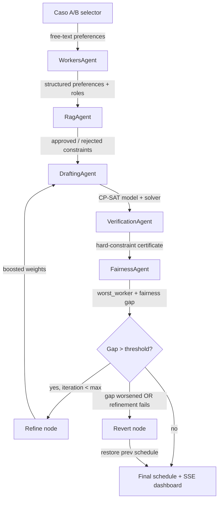

<!-- prettier-ignore -->

<div align="center">

<svg xmlns="http://www.w3.org/2000/svg" width="72" height="72" viewBox="0 0 24 24" fill="none" stroke="currentColor" stroke-width="1.5" stroke-linecap="round" stroke-linejoin="round" aria-hidden="true"><rect x="3" y="4" width="18" height="18" rx="2" ry="2"></rect><line x1="16" y1="2" x2="16" y2="6"></line><line x1="8" y1="2" x2="8" y2="6"></line><line x1="3" y1="10" x2="21" y2="10"></line><path d="M8 14h.01"></path><path d="M12 14h.01"></path><path d="M16 14h.01"></path><path d="M8 18h.01"></path><path d="M12 18h.01"></path><path d="M16 18h.01"></path></svg>

# SmartScheduler

**Hybrid Multi-Agent Scheduling System for Hospital Guard Shifts**

[](https://www.python.org)
[](https://react.dev)
[](https://www.typescriptlang.org)
[](https://vitejs.dev)
[](https://www.langchain.com)
[](https://developers.google.com/optimization)
[](https://python.langchain.com/docs/concepts/rag/)
[](LICENSE)

[Overview](#overview) · [Features](#features) · [Architecture](#architecture) · [Getting Started](#getting-started) · [Usage](#usage) · [Project Structure](#project-structure)

</div>

---

## Overview

SmartScheduler automates the generation of hospital guard shifts for medical staff. It combines the mathematical precision of **Google OR-Tools CP-SAT** with the reasoning capabilities of **Large Language Models** (Gemini via LangChain/LangGraph, with optional Ollama support) into a single, auditable pipeline.

Doctors express preferences in plain text (e.g. *"I prefer not to work night shifts on weekends"* or *"I need December 25th off"*). The system parses these requests, checks them against a hospital regulation PDF using a local RAG compliance agent, builds a mathematically feasible schedule, verifies every hard constraint deterministically, and iteratively refines the result to maximize fairness across all workers.

A React + Vite frontend streams every step of the pipeline in real time via Server-Sent Events, so you can watch the agent loop as it runs.

## Features

- **Natural-language preference parsing** — free-text worker requests are converted into a structured, validated preference model. Recognises both English and Italian hard/soft constraint phrases. Automatically detects worker roles (standard / specialist) from natural language.
- **RAG compliance audit** — a ReAct agent grounded in a hospital regulation PDF approves or rejects custom constraints, citing the specific rule/article.
- **Mathematical scheduling** — Google OR-Tools CP-SAT enforces hard institutional constraints (one shift per day, post-night rest, weekly hour limits, coverage requirements, total shift quotas).
- **Dual scenario support** — Caso A (13 homogeneous workers) and Caso B (13 standard + 7 specialist workers with specialist coverage constraints ≥2 std + ≥1 spec per shift).
- **On-demand code generation** — for non-standard soft constraints (e.g. "only even-numbered days", "avoid morning-then-afternoon next day"), the DraftingAgent generates CP-SAT snippet code via LLM and exec's it into the model at runtime.
- **Deterministic verification** — a zero-LLM verification agent certifies that every hard constraint is satisfied, including specialist coverage (≥3 workers with ≥1 specialist per shift for Caso B).
- **Fairness-driven refinement** — a Rawlsian maximin loop identifies the most disadvantaged worker and boosts their preferences until the fairness gap closes or the iteration cap is reached. If a refinement step increases the gap or fails to solve, the system automatically reverts to the previous better schedule.
- **Real-time dashboard** — React UI visualizes the LangGraph pipeline as it executes, with live RAG verdicts, generated CP-SAT code blocks, a final interactive schedule grid, a floating elapsed timer, and a scenario selector (Caso A / Caso B).
- **Stop button** — cancel a running pipeline directly from the UI.
- **Worker detail panel** — click any doctor in the schedule to inspect their role, shift weights, hard constraints, and soft preferences.

## Architecture



### Components

| Component                  | Location                           | Responsibility                                                                              |
| -------------------------- | ---------------------------------- | ------------------------------------------------------------------------------------------- |
| **FastAPI server**         | `src/server.py`                    | Exposes `/api/stream?case=a\|b` (SSE) for scenario-aware pipeline streaming.                |
| **LangGraph orchestrator** | `src/agents/orchestrator.py`       | Compiles the agent graph, routes refinement loop, handles revert on refinement failure.     |
| **WorkersAgent**           | `src/agents/workers_agent.py`      | Parses natural-language preferences (IT/EN) into structured JSON with role detection.       |
| **RagAgent**               | `src/agents/rag_agent.py`          | ReAct agent over `regolamento_ospedaliero.pdf` for compliance checks on custom constraints. |
| **DraftingAgent**          | `src/agents/drafting_agent.py`     | Builds CP-SAT model (Caso A/B coverage); handles both initial draft and fairness refinement via `worst_worker`-driven weight boosting; generates custom soft-constraint code on demand. |
| **VerificationAgent**      | `src/agents/verification_agent.py` | Deterministic validation of hard constraints incl. specialist coverage (Caso B).            |
| **FairnessAgent**          | `src/agents/fairness_agent.py`     | Computes satisfaction scores and identifies the worst-off worker.                           |
| **Select component**       | `ui/src/components/base/select/`   | Reusable custom drop-down for scenario selection and similar UI controls.                   |
| **React dashboard**        | `ui/src/App.tsx`                   | Real-time pipeline UI, schedule grid, RAG/code logs, fairness metrics, floating timer.      |

## Getting Started

### Prerequisites

- Python 3.10+
- Node.js 20+ and npm
- A Google Gemini API key (`GEMINI_API_KEY`) for cloud LLM calls
- (Optional) [Ollama](https://ollama.com/) for local/private LLM execution

### Backend setup

```bash
# Clone the repository
git clone https://github.com/lucatimpano/Hybrid-Agentic-Scheduler.git
cd Hybrid-Agentic-Scheduler

# Create and activate a virtual environment
python3 -m venv .venv
source .venv/bin/activate

# Install Python dependencies
pip install -r requirements.txt

# Configure the API key
cp .env.example .env  # or create .env manually
# Add: GEMINI_API_KEY=your_key_here
```

> [!IMPORTANT]
> WorkersAgent and DraftingAgent require a Gemini API key. VerificationAgent and FairnessAgent are fully deterministic and do not call any LLM.

### Frontend setup

```bash
cd ui
npm install
```

### One-command start

```bash
./start.sh
```

The script checks dependencies, starts both backend and frontend, and lets you stop everything with `Ctrl+C`.

### Run the full pipeline from the CLI

```bash
# Edit CASE = "a" or CASE = "b" in src/main.py to select scenario
PYTHONPATH=. .venv/bin/python src/main.py
```

The final schedule is written to `data/output/final_schedule.json`.

### Run the streaming server + dashboard (manual)

In one terminal, start the FastAPI backend:

```bash
PYTHONPATH=. .venv/bin/python src/server.py
```

In another terminal, start the Vite dev server:

```bash
cd ui
npm run dev
```

Open `http://localhost:5173` in your browser. The UI connects to `http://localhost:8000/api/stream`.

> [!TIP]
> If you prefer to run everything locally, configure Ollama and set the appropriate local model in the agent configuration. This avoids cloud API costs and keeps data on your machine.

## Usage

### Input files

All inputs live under `data/input/`:

- `workers_preferences.txt` — free-text preferences for Caso A (13 homogeneous workers).
- `workers_preferences_caso_b.txt` — free-text preferences for Caso B (13 standard + 7 specialist workers).
- `hospital_config.json` — coverage requirements, shift types, and role mappings.
- `regolamento_ospedaliero.pdf` — hospital regulation used by the RAG compliance agent.

Use the **Scenario** drop-down in the UI or the `CASE` variable in `main.py` to switch between Caso A and Caso B.

### Output

- `data/output/final_schedule.json` — the generated month schedule.
- The React dashboard also displays the schedule grid, worker detail panel, RAG verdicts, and fairness metrics.

### UI overview

- **Scenario selector** — top bar drop-down to switch between Caso A (13 workers) and Caso B (20 workers with specialists).
- **Config panel** — shows current worker count, days, scenario, and Run/Stop buttons.
- **Pipeline steps** — each LangGraph node appears as a step. `verify_node` and `fairness_node` are grouped under a single *Quality Gate* composite step. Refinement/revert events are logged inside the Quality Gate.
- **RAG verdicts** — approved or rejected constraints show the rule/article badge and the cited reason.
- **Generated code** — CP-SAT soft-constraint code emitted by DraftingAgent is rendered in collapsible code blocks.
- **Schedule grid** — rows are doctors, columns are days; click a doctor to open the preferences panel.
- **Floating timer** — elapsed time displayed in bottom-right corner during and after pipeline execution.
- **Stop button** — aborts a running pipeline immediately.

## Project Structure

```text
.
├── data/
│   ├── input/                  # preferences (caso A + B), config, regulation PDF
│   └── output/                 # generated schedule JSON
├── src/
│   ├── agents/                 # LangGraph agent implementations
│   │   ├── drafting_agent.py
│   │   ├── fairness_agent.py
│   │   ├── orchestrator.py
│   │   ├── prompts.py
│   │   ├── rag_agent.py
│   │   ├── verification_agent.py
│   │   └── workers_agent.py
│   ├── models/                 # Pydantic schemas + OR-Tools wrapper
│   │   ├── ortools_wrappers.py
│   │   └── schemas.py
│   ├── server.py               # FastAPI + SSE backend
│   └── main.py                 # standalone CLI entrypoint
├── ui/
│   ├── src/
│   │   ├── components/
│   │   │   └── base/select/    # custom Select component
│   │   ├── App.tsx             # main dashboard
│   │   ├── App.css             # styles + animations
│   │   └── main.tsx
│   └── package.json
├── start.sh                    # one-command backend + frontend startup
├── requirements.txt
└── README.md
```

## Resources

- [LangGraph documentation](https://langchain-ai.github.io/langgraph/)
- [LangChain documentation](https://python.langchain.com/)
- [Google OR-Tools CP-SAT](https://developers.google.com/optimization/cp/cp_solver)
- [FastAPI](https://fastapi.tiangolo.com/)
- [React](https://react.dev) · [Vite](https://vitejs.dev)
